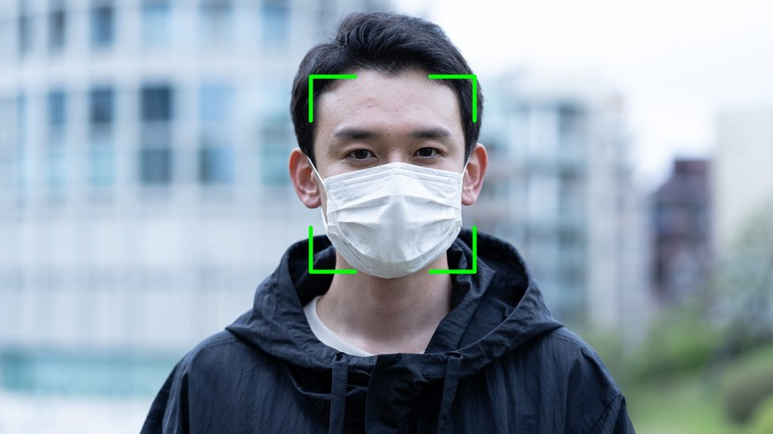

# MaskPi

<picture>
  
</picture>

## Introduction
a project that as a first step detects whether you are wearing a mask or not, and then accordigly writes "allowed" or "violating code", if the case was the second it recognizes the person who is violating the code.

## components 
## Software 
## 1.Libraries 
Teachable_machine_lite
cv2
pickle 
Face recognition 
time 
RPi.GPIO
imutils 
## 2.Algorithms 
Haarcascade

## Hardware
Raspberry pi controller 
Raspberry pi camera

## Team members 
Yasmeen Jalloud 
Aseel Takhman
